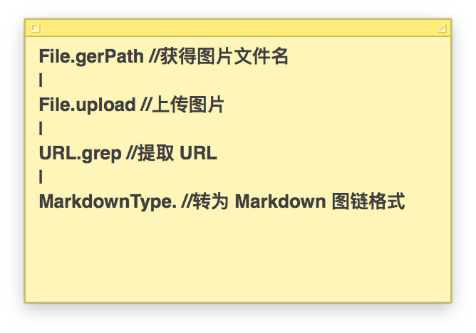
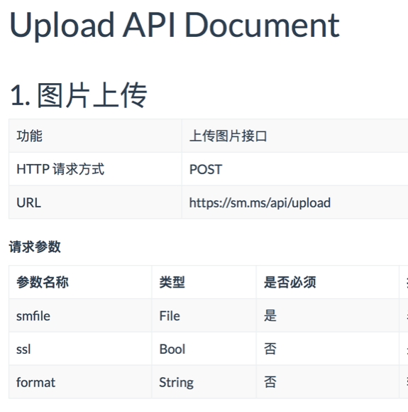
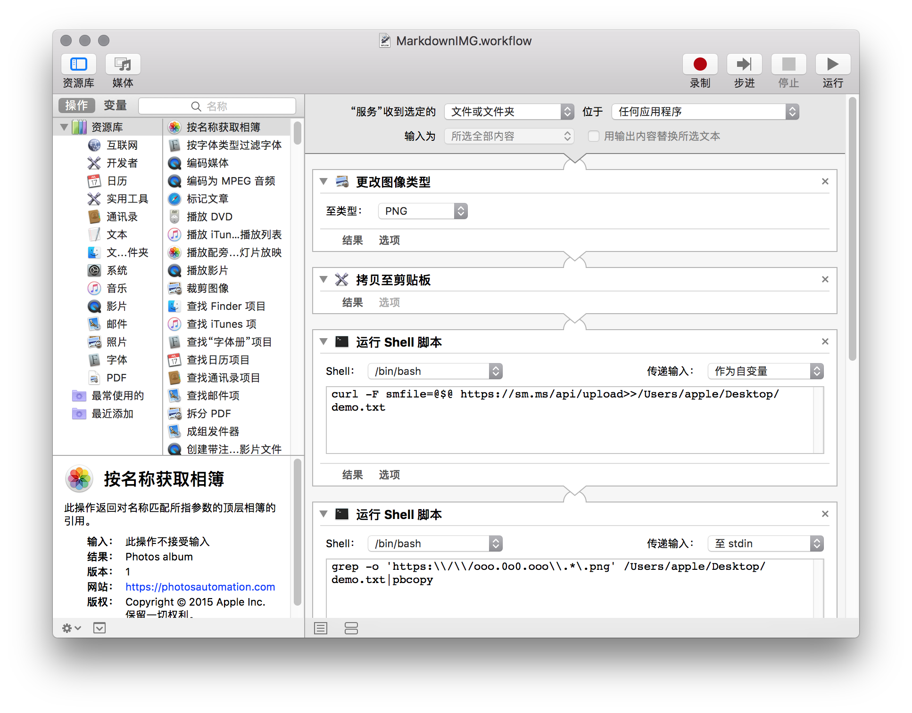
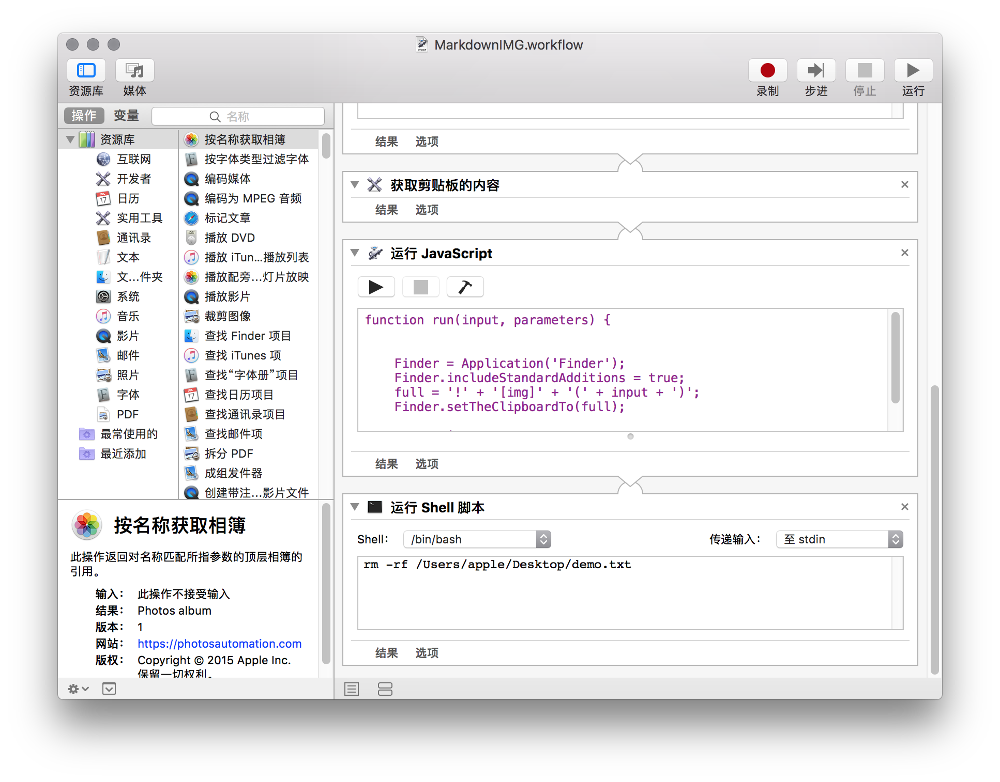
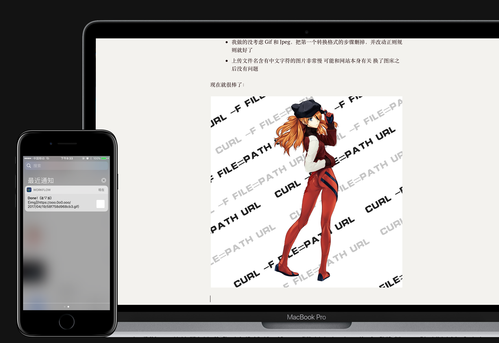

如果你还在写博客，如果你还在用图床（而不是微博和 QQ 空间），如果你企图用自动化工具在写作时插链接和图片，会发现可供选用的软件太多了，但是少有纯粹优雅的。

在手机上，借助拥有「魔法变量」与正则表达的 Workflow，我很快写了一个小插件。而在 MacBook 上虽然有着更多选择（Python 脚本、Alfred 工作流乃至图床软件），我却倾向于用 shell 写一个更优雅的。毕竟，没人愿意和一个“在 Automator 里通过 shell 调用 python 并且要下载莫名其妙的项目”的家伙聊天。不幸的是我暂时还没有能完全自如使用 shell，所以有一段代码是用 javascript 写的。相信我，它们太好理解了，像写在美式拍纸上的 Taskpaper！以至于我列购物清单的时候都喜欢组织成 javascript（你也可以理解为 Python :D）的语法格式。

这是我实现的效果：


我要达到这样的目标：

- 任何地方，右键上传图片，直接返回 Markdown 格式的图链到剪贴板
- 排除网速干扰，必须要足够快，在我把光标重新定位好以前跑完
- 随时可以调用，全局可以调用
- 没有菜单栏图标，没有 Dock 栏图标，只需要一个启动按钮和一声提示音
- 只使用系统命令，不依赖任何第三方包

很疯狂，开始摇滚吧 :D

我有一个思路：



我选择的图床是 sm.ms,当然无论这个产品免费与否，都要做好备份，不能把所有图片存在一个地方。来看一下它的 API：



想用 shell 来和它交互的话，只需要传递一个 smfile 的值就好了，它就是所需上传之图片在本地的路径。于是我有了这样的一段 Automator：



在这里，弄清楚变量是最必要的。文件作为输入，获得的是路径。然后执行一个 shell，用 curl 命令和网页交互：

```
curl -F smfile=@[FilePath] apiURL
```

由于在 Automator 的 「do shellscript」 里不能直接使用「变量」，所以要靠「$@」来把上一步获得的文件路径传递到 shell 脚本里。然后网站会返回一堆数据，里面就包含了我需要的 URL。但是我还要用「>>」把 curl 的输出导进一份临时文本，以便接下来用 grep 取出 URL。得到 URL 后用 pbcopy 把结果复制到系统剪贴板。接下来，把链接处理成 Markdown 的格式：



这里用了一个简单的 javascript 脚本来组合文本。要注意这一步的输入，得先取得一下系统剪贴板内容。这段代码跑完后链接就拷贝到剪贴板了。最后的一段 shell 用来删掉刚才的临时文件。

至此这个小工具就能使用了，不过我很快发现了两个问题：

- 我做的没考虑 Gif 和 Jpeg，把第一个转换格式的步骤删掉，并改动正则规则就好了
- 上传文件名含有中文字符的图片非常慢 可能和网站本身有关 换了图床之后没有问题

现在就很棒了：



****

网页交互参考：

- [Workflow + Drafts + 七牛云，用更酷的姿势写作 - 少数派](https://sspai.com/post/36990)
- [使用七牛云存储和alfred的workflow简化markdown贴图流程 - 简书](http://www.jianshu.com/p/2272e996cb36)
- [Workflow 教程（八）：利用新的请求方法打造 Web 小程序 - 少数派](https://sspai.com/post/35857)

javascript 参考：

- [用Automator实现网页标题自动存为Markdown文字超链接格式 - 简书](http://www.jianshu.com/p/40d9b0961317)
