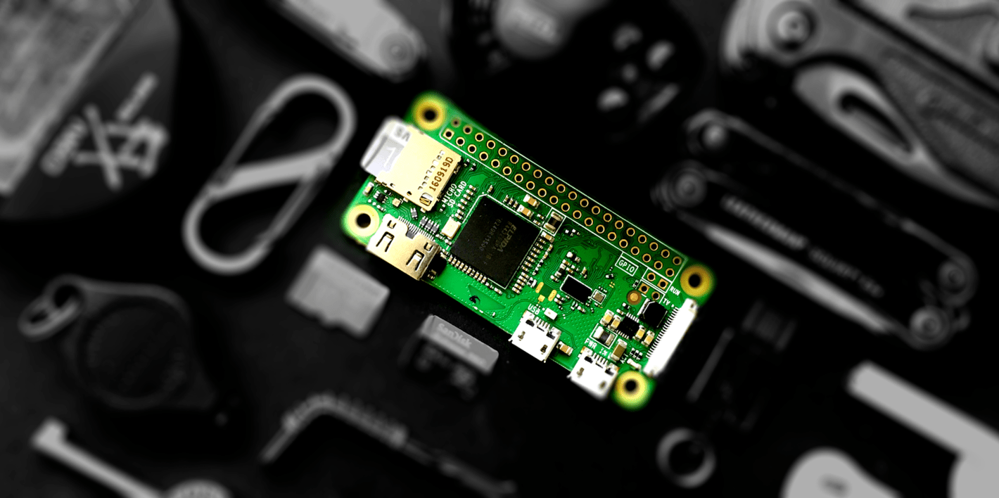
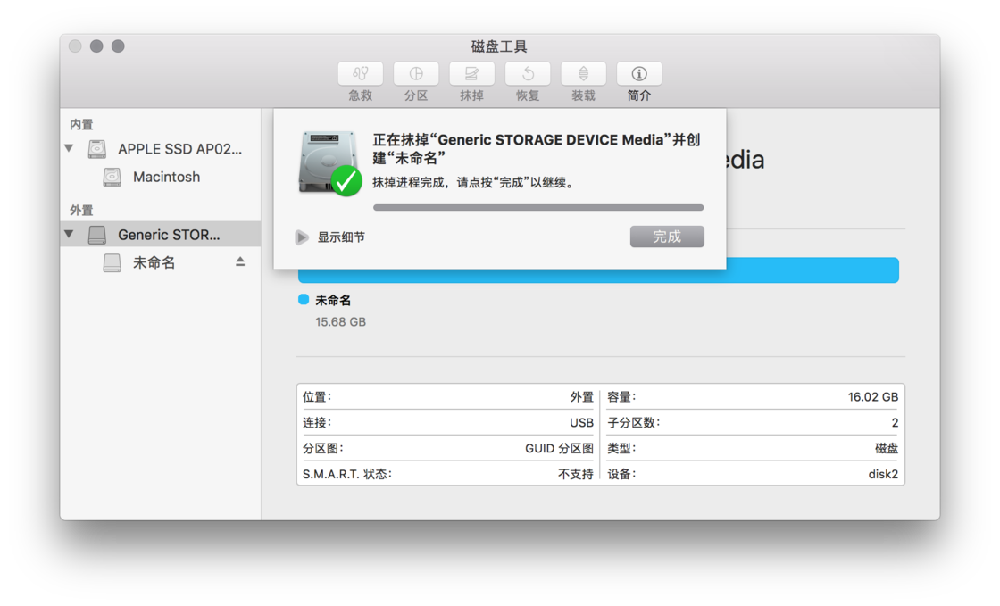
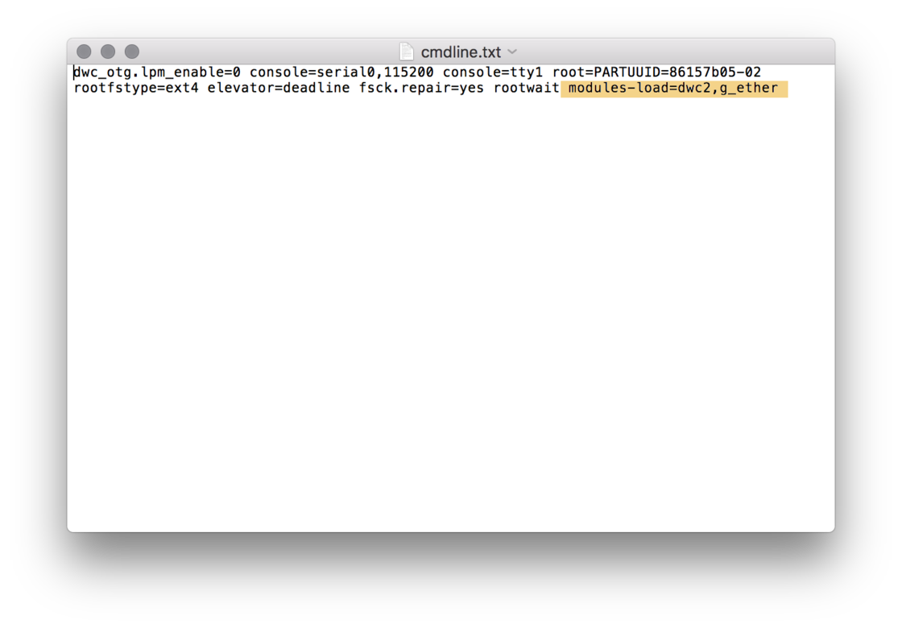
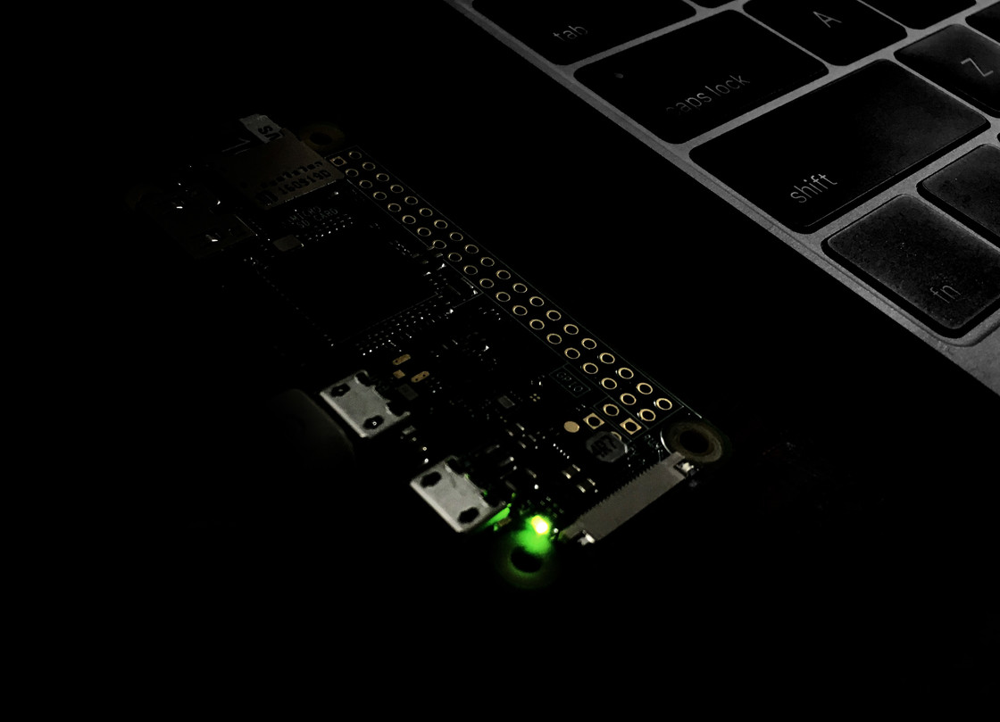
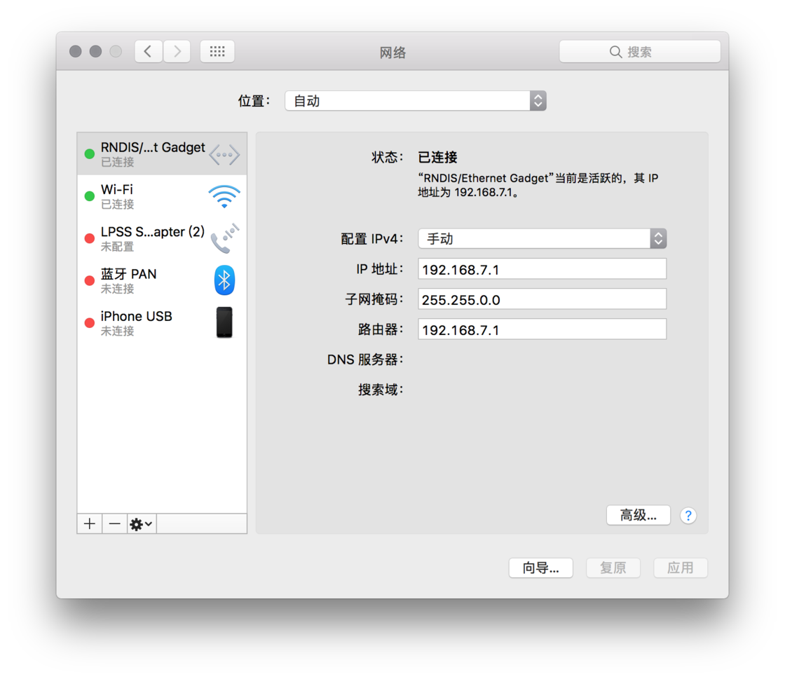

本文旨在教你全程只用一根线玩树莓派基础功能。

树莓派 zero w 是该家族最新的产品，可谓单片机工艺代表，梯形陶瓷天线、精密集成电路，赋予这张小卡片基本的蓝牙、Wi-Fi 功能，却不增加体积。紧凑的树莓派 B+ 有「信用卡电脑」美称，更小巧的 zero w 则称得上「口香糖电脑」。

这样精致的产品，我不忍看它身上插满数据线，变成重症监护室里的病号。我做了一些功课，只消一根 USB 线，优雅食用新鲜树莓派。

## 准备 

### 设备

- 树莓派 zero／zero w
- TF 卡（至少8G）
- Micro USB 数据线
- 电脑（本文以 MacBook 为例）

### 操作环境

- macOS 10.12
- bash


## 烧录

树莓派支持很多系统，小子建议使用Raspbian，能得到更多的社区支持。现在开始制作启动盘。

从[官网](https://www.raspberrypi.org/downloads/raspbian/)下载镜像，~~洗净切片~~备用

格式化你的 TF 卡▼



之后依次输入以下命令：

```
df #查找内存卡
diskutil unmount 内存卡名字 #卸载内存卡
diskutil list'获取当前内存卡名
sudo dd bs=4m if=镜像文件名 of=当前内存卡名
```

需要输入密码，盲输入后回车。注意命令要替换成你实际遇到的名称，不要随手复制粘贴哦。dd 命令之后等待数分钟，就烧制好了。

## 连接

想通过 USB 数据线连接树莓派和电脑，只需将派设置成 USB 网卡。

修改 TF 卡根目录下 config.txt，新加一行：

```
dtoverlay=dwc2
```


修改 TF 卡根目录下 cmdline.txt，在 rootwait 后增加（开头有空格）：

```
 modules-load=dwc2,g_ether
```



随后在其根目录新建名为 ssh 的空文件，以开启派的 ssh 连接。用文本编辑新建 ssh.txt,再去除拓展名即可。

将卡插上树莓派，用左侧 Micro-USB 口连接到电脑。这个接口可同时供电和传输数据，右侧的则只司输电。开机后派的指示灯会亮起▼



稍等一分钟，电脑网络设置中可找到该网卡（第一项）▼


此时的树莓派还没有固定地址，用这些命令来设置一下：

```
#打开配置界面
sudo nano /etc/network/interfaces
```

```
#配置 IP 地址
allow-hotplug usb0x
iface usb0 inet static
address 192.168.7.2
netmask 255.255.255.0
network 192.168.7.0
broadcast 192.168.7.255
gateway 192.168.7.1
```

```
#重启该网卡
sudo ifdown usb0
sudo ifup usb0
ifconfig usb0
```

然后在电脑的网络设置中配置一下派▼



随后就能使用固定地址 ssh 到树莓派了。如果询问密码，劳烦输入初始密钥「raspberry」。登陆命令如下：

```
ssh pi@192.168.7.2
```

## 关机

尽量使用命令关机，直接插拔可能导致字库损坏。这是一条比较简洁的命令：

```
sudo halt
```

树莓派的指示灯在闪烁几下后会熄灭，方可拔下数据线。

## 结语

树莓派 zero w 让我想起那些 Ultralight 的户外用品。区区一百克的粗苯冲锋衣、两厘米长的氧化锆小刀、不足十克的纽扣电池手电，只有两种人会选择这些东西：深刻明白自己需求的「老驴」，以及傻萌钱多的新手。

同样的价格，能买到数倍性能的其他主板，但是 zero w 有它自己的魅力。想要一个即插即用的本地服务器（比如一条裤子），一个便携的开发环境，zero w 正合适。但在 iPhone 都有 Pythonista、New MacBook 都能跑虚拟机的今天，单独购买一只树莓派的必要性不是很大，我更多是为了好玩。

完成旅行装备轻量化后，我也开始给电子产品「减负」，MacBook pro 换成 MacBook，iPhone6S 换成 iPhoneSE。我开始触摸到自己真正的需求，也明白让人 Powerful 的不单单是工具。

既然无法像公众印象里的极客那般面朝机箱，春暖花开，便顾自轻装上路，沿途欢歌。

------

参考链接

- [Mac OSX下给树莓派安装Raspbian系统 | 树莓派实验室](http://shumeipai.nxez.com/2014/05/18/raspberry-pi-under-mac-osx-to-install-raspbian-system.html?variant=zh-cn)
- [raspberry pi zero通过usb进行ssh连接 - talkxin的博客 - CSDN博客](http://blog.csdn.net/talkxin/article/details/53066555)
- 树莓派系统下载[Download Raspbian for Raspberry Pi](https://www.raspberrypi.org/downloads/raspbian/)