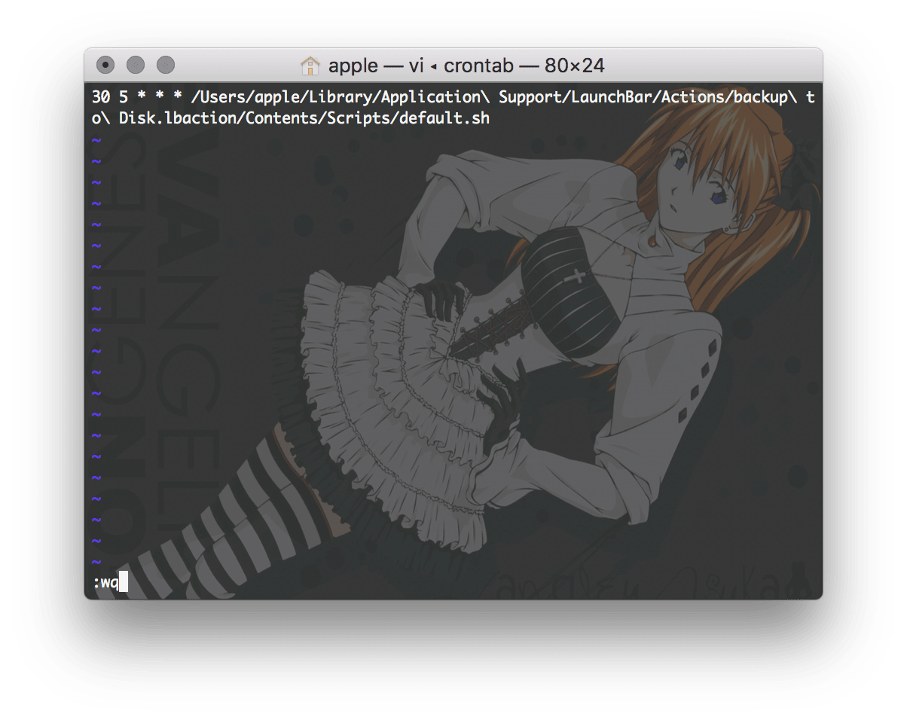

LaunchBar 没有自动备份 Actions 的功能。所幸这些 Actions 可以在 Finder 里找到源文件，我们备份源文件就实现了 Actions 的备份。

基本的原理，还是借助一个命令行工具 rsync，将 Actions 文件夹增量同步到指定位置（我选的是 iCloud）。

## 手动备份：用 LaunchBar

首先想到的是手动备份 Actions，可以用 LaunchBar 自身来实现。创建一个动作，粘上下面的 shell 脚本：

```
# backup LaunchBar Action
rsync -av /Users/apple/Library/Application\ Support/LaunchBar/Actions/ /Users/apple/Library/Mobile\ Documents/com\~apple\~CloudDocs/Automation/Launchbar\ Action/ --delete

osascript -e 'display notification "But he backup it :D" with title "osa is not a person" sound name "Submarine"'
```


## 自动备份：用 crontab

如果想让 Actions 自动备份，可以借助系统的 crontab。

1. 打开终端，输入：`crontab -e`，回车打开 vi 编辑器；
2. 按 `i` 进入编辑模式；
3. 输入自动备份的时间，比如 `30 5 * * * `（表示每天凌晨 5:30）；
4. 把上一节所做备份动作内的脚本[^1]拖进备份时间后面；
5. 连按几次 `Esc` 直到电脑开始嘟嘟抗议，随后输入 `:wq` 保存并退出。



不过，crontab 在电脑盒盖休眠时无法工作，要等你掀开盖子那一刻它才会动起来。

关于 rsync 的工作方式，可以看我以前的文章：[文件备份还能怎么玩？试试这条命令](https://sspai.com/post/41967)

[^1]:找不到？右键备份动作，Show in Finder，查看包内容，翻翻里面的 Script 文件夹。